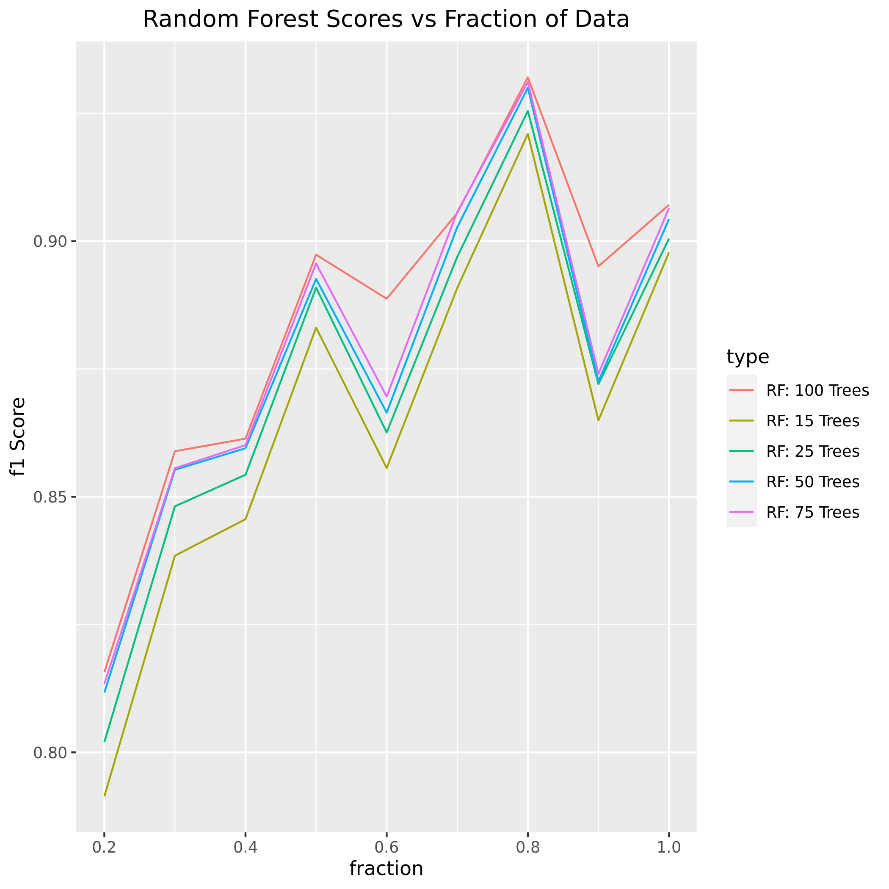
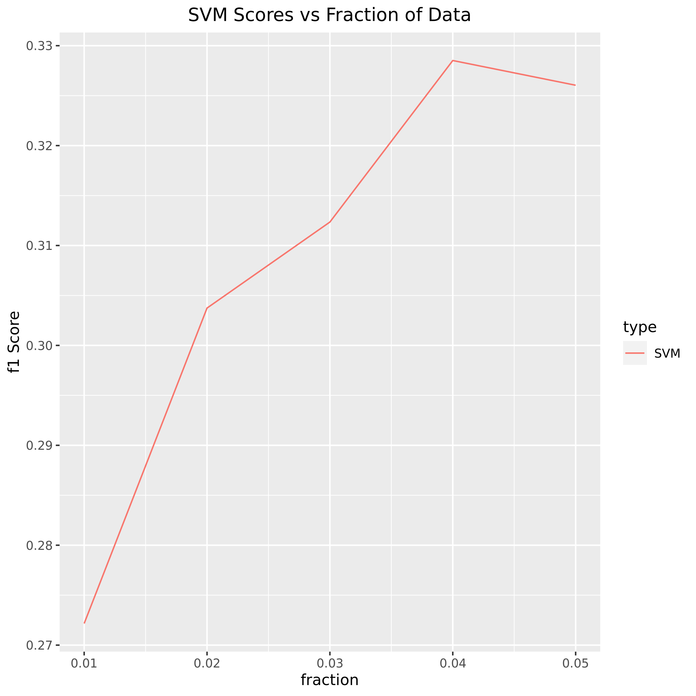

**BCB 503 \
Assignment 3 \
March 29, 2022 \
Justin Moy, Junpei Xiao, Emmaline Raven**
# BCB503 Assignment 3 Report
## A. Description of Data
The data set has the title “Human Activity Recognition from Continuous Ambient Sensor Data Data Set.” This means that ambient sensors were used to record various human activities, sorted by different household rooms. It has time-series data containing integer and real number values. It contains 37 different attributes. Like most large datasets, it has missing values. The dataset was broken into 21 different CSV files. The files each contain different sets of attributes in a way such that they could be combined into one full dataset. For the purposes of data analysis, they were combined into one dataset (see Data Acquisition and Preprocessing).

Although there were 37 different attributes in the dataset, many of them were irrelevant for the data processing and analysis completed for the project. Complexity was one of the attributes analyzed in **basic_stats.py**, and is described in the University of California, Irvine website as “Complexity or measure of entropy in sensor counts.” For each room or home space (the bathroom, bedroom, chair, dining room, hall, kitchen, living room, office, outside door, and work area), there is an attribute for “[t]he weighted count of th[e] sensor, starting at 1.0 for the most recent event each sensor event previous is worth n-0.01 the current event.” Each area also has an attribute for “[t]he number of seconds since this sensor was last seen, up to a maximum of 86400.” Finally, most importantly, there is an attribute “activity,” which lists the activity being observed. This is the class predicted by the machine learning algorithms described below.
## B. Methodology
The analysis of this dataset was broken into several phases, first the data was acquired and preprocessed, second subsets of the data were produced, third SVM and random forest were run on the dataset, fourth the same machine learning was run on datasets with zero replaced, and last the data was visualized. Generally speaking, for all headers on files that were run on the cluster, the maximum memory, maximum memory per CPU, and maximum time were set.
#### SBATCH Header
```sh
#!/bin/bash
#SBATCH -N 1
#SBATCH -n 4
#SBATCH --mem=MaxMemPerNode
#SBATCH --mem-per-cpu=MaxMemPerCPU
#SBATCH -t 12:00:00
```
### Data Acquisition and Preprocessing
The shell script **preprocess.sh** was used to acquire and preprocess the data. The dataset was acquired from the University of California, Irvine's website using the `wget` command. This data was a 13GB zip file which had to be unzipped. Once all of the files were unzipped, the zip file was removed. Next, the data had to be merged together into a single csv file. This was done using the `awk` command in the **mergecsv.sh** script. This took each csv file that ended in ".ann.features.csv" and combined them into a single csv file. During this step, column 14, the numDistinctSensors feature was dropped because that value was always set to zero. As part of the data acquisition, **basic_stats.py** and **basic_stats_updated.sh** were used to summarize the dataset.
#### preprocess.sh
```sh
wget https://archive.ics.uci.edu/ml/machine-learning-databases/00506/casas-dataset.zip -P ./data/
unzip ./data/casas-dataset.zip
rm ./data/casas-dataset.zip
./mergecsv.sh "./data/*/*.ann.features.csv" ./data/1.0subset.csv
```
#### mergecsv.sh
```sh
awk 'FNR==1 && NR!=1{next;}{print}' $1 | cut -d, -f14 --complement > $2
```
#### basic_stats.py
```python
import pandas as pd

df = pd.read_csv("/home/ejraven/bcb503-a3/1.0combined.csv")

#List all columns in the dataset
print("All columns in dataset")
for col in df.columns:
    print(col)

#List all activities recorded
print("\nAll activities recorded")
activities_list = df["activity"].unique()
for activity in activities_list:
    print(activity)

#Most frequent activity recorded
print("\nAll activities recorded")
df["activity"].mode()

#Average complexity (complexity or measure or entropy in sensor counts)
print("\nAverage complexity (complexity or measure or entropy in sensor counts)")
print(df["complexity"].mean())

#Average number of seconds since the bedroom sensor was last seen
print("\nAverage number of seconds since the bedroom sensor was last seen")
print(df["sensorElTime-Bedroom"].mean())
```
#### basic_stats_updated.sh
```sh
/home/ejraven/anaconda3/bin/python3 basic_stats.py
```
### Subset Generation
In order to generate subsets, both a python file and shell script were used. The python file **subset.py**, takes in command line arguments so it is compatible with bash. It contains a single function which reads the entire dataset as a pandas dataframe. Next it groups the dataframe by the label and then randomly samples a user-defined proportion of each group such that the subsets keep their class distribution. This sampling is then converted into a csv file. The shell script **make_subsets.sh** used a for loop to generate subsets from 20% of the data to 90% of the data. The files were saved as csv files.
#### subset.py
```python
import sys
import pandas as pd
infile = sys.argv[1]
label = sys.argv[2]
prop = float(sys.argv[3])
outfile = sys.argv[4]

def stratified_sample(infile, label, prop, outfile):
    df = pd.read_csv(infile)
    sample = df.groupby(label, group_keys=False).apply(lambda x: x.sample(frac=prop))
    sample.to_csv(outfile, index=False)

if __name__ == "__main__":
    stratified_sample(infile, label, prop, outfile)
```
#### make_subsets.sh
```sh
for i in `seq 0.2 0.1 0.9`
do
	python subset.py ./data/combined.csv activity $i ./data/$i"subset".csv
done
```
### Machine Learning
For the two machine learning algorithms, we decided to use random forests with tree size 15, 25, 50, 75, and 100 and svm on 20% through 100% in increments of 10% of the data with the scikit learn python library. Initially, we tried to run K-fold validation for random forests of tree size 25, 50, 100, 200, and 400; however not all of those trees could run and SVM did not run at all. Therefore we went with the smaller tree sizes listed before on 20% through 100% in increments of 10% and ran SVM for 1% through 5% in increments of 1%. To run the algorithms **ml.py** was written. For the K-fold cross validation, the kfold flag was set to true in the arguments. This flag uses `cross_val_score` to do simultaneous cross validation and uses `StratifiedKFold` to maintain class distribution. Without that flag, an 80-20 test train split is used instead for the model. For both with and without KFold, the f1-macro score was used to measure how well each model performed. For KFold the reported f1-macro was the average of all of the trials. The fraction of data used, score, and algorithm used were output into a csv file. To get the fraction of the data, the decimal equivalent was extracted from the input file name with the regular expression "[0-9][.][0-9]+". In order to actually run this code on the cluster, three scripts were written: **run_batch.sh**, **run_rf.sh**, and **run_svm.sh**. Both **run_rf.sh** and **run_svm.sh** are currently configured to not do K-fold validation. **run_batch.sh** is a helper script and uses a for loop to submit separate sbatch jobs for each analysis type and is currently configured to submit substitute zeros jobs. This script maximizes the number of job submissions quickly since putting all the analysis into a single job would cause a timeout.
#### ml.py
```python
import argparse
from numpy import mean
import pandas as pd
import re
from sklearn.ensemble import RandomForestClassifier
from sklearn.metrics import f1_score
from sklearn.model_selection import cross_val_score
from sklearn.model_selection import StratifiedKFold
from sklearn.model_selection import train_test_split
from sklearn.preprocessing import StandardScaler
from sklearn.svm import SVC

parser = argparse.ArgumentParser(description='validate classifications')
parser.add_argument('--kfold', action=argparse.BooleanOptionalAction, help="do k-fold validation")
parser.add_argument('input', help='input file')
parser.add_argument('output', help='output file')
parser.add_argument('model', help='SVM or RF')
parser.add_argument('treeqty', type=int, nargs='?', default=100, help='Number of trees for random forest')

args = parser.parse_args()

def validate_model(doKfold, input, output, model, numTrees):
    frac = float(re.findall(r"[0-9][.][0-9]+", input)[-1])
    data = pd.read_csv(input)
    X = data.drop(columns=["activity"])
    X = StandardScaler().fit_transform(X)
    y = data["activity"]
    
    if model == "SVM":
        clf = SVC()
        name = model
    elif model == "RF":
        clf = RandomForestClassifier(n_estimators=numTrees, random_state=1)
        name =  "RF: " + str(numTrees) + " Trees"
        
    if doKfold:
        cv = StratifiedKFold(random_state=1, shuffle=True)
        score = mean(cross_val_score(clf, X, y, scoring='f1_macro', cv=cv, n_jobs=-1))
    else:
        X_train, X_test, y_train, y_test = train_test_split(X, y, test_size=0.2, random_state=1)
        clf.fit(X_train, y_train)
        y_pred = clf.predict(X_test)
        score = f1_score(y_test, y_pred, average='macro')
        
    entry = [frac, score, name]
    result = pd.DataFrame([entry], columns=["fraction", "score", "type"])
    result.to_csv(output, index=False)

if __name__ == "__main__":
    validate_model(args.kfold, args.input, args.output, args.model, args.treeqty)
```
#### run_rf.sh
```sh
python ml.py ./data/$1"subset".csv ./scores/single/$1"RF"$2.csv RF $2
```
#### run_svm.sh
```sh
python ml.py ./data/$1"subset".csv ./scores/single/$1"SVM".csv SVM
```
#### run_batch.sh
```sh
for frac in `seq 0.1 0.1 0.9`
do
	sbatch run_sub_zeros.sh $frac
done
```
### Zero Replacement
In order to substitute a given proportion of cells with zeros, **substitute_zeros.py** was written. This python script first stores the class labels separately and drops them from the data set so they are not accidentally turned into zeros. Next, a list is made of each row and column. Then coordinates in that list are randomly sampled so that the given proportion of cells are chosen and converted to zeros. The class labels were then rejoined to the dataframe and the new dataset was output as a csv file. The above machine learning algorithms were then used on these new datasets. **sub_zeros.sh** was then used to wrap the python file as runnable by **run_batch.sh**. The 0.5 subset was chosen to do zero replacement because it seemed to be at the elbow of f1 score improvement.
#### substitute_zeros.py
```python
import argparse
import pandas as pd
import random

parser = argparse.ArgumentParser(description='Substitute fraction of dataframe with zeros')
parser.add_argument('input', help='input file')
parser.add_argument('output', help='output file')
parser.add_argument('frac', type=float, help='fraction to replace')
args = parser.parse_args()

def substitute_zeros(infile, outfile, frac):
    data = pd.read_csv(infile)
    label = data[["activity"]]
    data.drop(columns=["activity"])
    
    ix = [(row, col) for row in range(data.shape[0]) for col in range(data.shape[1])]
    for row, col in random.sample(ix, int(round(frac*len(ix)))):
        data.iat[row, col] = 0
        
    data["activity"] = label
    data.to_csv(outfile, index=False)
    
if __name__ == "__main__":
    substitute_zeros(args.input, args.output, args.frac)
```
#### sub_zeros.sh
```sh
python substitute_zeros.py ./data/0.5subset.csv ./zeros/$1"zeros".csv $1
```
### Datavisualization
As opposed to previous sections, R instead of python was used to visualize the results. Before the graphs could be made, each individual result csv had to be combined into a single csv for each type of analysis. This was done using the **combineresults.sh** which used **mergecsv.sh** to combine the results for kfold, single model, SVM, and zeros into 4 different csvs for analysis. Next **groupgraphs.R** was used to graph the csv files with the x-axis being the fraction, y-axis being the f1 score, and the color being the algorithm type.
#### combineresults.sh
```sh
./mergecsv.sh "./scores/kfold/*.csv" ./scores/kfold.csv
./mergecsv.sh "./scores/single/*.csv" ./scores/single.csv
./mergecsv.sh "./scores/svm/*.csv" ./scores/svm.csv
./mergecsv.sh "./scores/zeros/*.csv" ./scores/zeros.csv
```
#### groupgraphs.R
```R
library(tidyverse)

graph_groups <- function(csv, output, title) {
  data <- read.csv(csv, header=TRUE)
  ggplot(data, aes(x=fraction, y=score)) + geom_line(aes(color=type)) +
	ggtitle(title) + ylab("f1 Score") + theme(plot.title=element_text(hjust=0.5))
  ggsave(output)
}

graph_groups("./scores/kfold.csv", "./img/kfold.png", "Random Forest Scores vs Fraction of Data\nwith 5-Fold Cross Validation")
graph_groups("./scores/single.csv", "./img/single.png", "Random Forest Scores vs Fraction of Data")
graph_groups("./scores/svm.csv", "./img/svm.png", "SVM Scores vs Fraction of Data")
graph_groups("./scores/zeros.csv", "./img/zeros.png", "Random Forest Scores vs Fraction of\n0.5 Data Subset Replaced with Zeros")
```
## C. Challenges
We have faced some problems when we were working on this project such as how to integrate shell script with python script to efficiently execute all jobs in a for loop. However, the biggest challenge is the out of memory issue caused by the extremely big data size. We want to see whether there is any improvement on the Random Forest model by including K-fold cross-validation, although it is not in the requirement for this project. We have tried running Random Forest and Support Vector Machine using ACE, Turing cluster, GPU and local high performance computer with modifying the number of nodes and usage of memory. However, it only worked for small subsets of data and numbers of trees — no more than 100.
## D. Results
Initially we tried to run 5-fold cross validation on SVM and random forest with 25, 50, 100, 200, and 400 trees; however due to time and memory limits, only the below data points were able to be collected. Notice that SVM, 200, and 400 trees were unable to run, while 50 and 100 trees were unable to run for all subsets. As expected, the f1 score increases with both the increase in data and increase in trees. Although the most dramatic increase is between 20% and 50% of the data.


Upon the issues of 5-fold cross validation, we tried only running a single model with the same number of trees, however that ran into the same issues, so we decreased the number of trees used to 15, 25, 50, 75, and 100. By using these tree numbers and only running a single model, we were able to get the more complete results below. Although we see a general increase in f1-score with data and tree size, the f1-score noticeably decreases at 0.6 and 0.9. Without 5-fold validation, this may be due to the way the test-train split occurred which shows the weakness of running just the single model. Like the 5-fold model, we do see a dramatic increase between 20% and 50% of data.



Unfortunately, like 5-fold, the single model was still unable to run SVM, so we further reduced the dataset to 1% to 5% of data and were able to run SVM. As the amount of data increases, so too does the f1-score; however, at 5% the f1-score decreases which may similarly be due to the test train split.



Because both 5-fold and single model seemed to have the most increase in f1-score at 0.5, the 0.5 subset was chosen to replace zeros with. As the graph below depicts, as the fraction of zeros increases, the f1-score decreases. This makes sense since as the number of zeros increases, the features separating different classes become more similar which would harm precision and recall.


## E. Team Coordination
In order to organize the group communication, Emma created a group chat with Junpei and Justin. During most of spring break, Justin and Emma were waiting for access to the ACE cluster (Junpei already had access to the Turing cluster). Junpei wrote a script to join the CSV files together into one CSV file. The group organized a meeting in the first week of D term to organize initial tasks. Justin had written the scripts to create the subsets and run all the machine  learning algorithms on the cluster. Junpei helped fix an issue with running out of memory. The group met again the following week to check in. For some tree numbers, we were unable to get data for k-fold. When we met again, Justin and Junpei split up the remaining jobs to run and Emma wrote a script to calculate statistics on the dataset. Justin wrote scripts to turn a certain portion of the data values into 0. Junpei submitted jobs for running SVM on different proportions of the dataset, as well as for running random forest on the dataset with different proportions of values equal to 0. Justin combined the csv outputs and created the data visualizations in R. Justin created the document and shared it with Emma and Junpei to write the report. Emma wrote the section of the report describing the dataset. Justin explained the code snippets. Junpei described challenges faced throughout the project. Justin explained the results and visualizations. Emma wrote this section explaining what each team member contributed, and Junpei wrote the final section. Justin converted the final report to markdown.
## F. Team Experience
We decided to include this part in the report, although it may be not relevant to the project. This is one of our best team project experiences at WPI. We are not just learning from the project itself but also from each other. Each member has their own unique skills such as statistical background, writing very formal python code and knowledge of shell script. When we bring them to the table and share them for a common purpose, we achieve what we expect.
